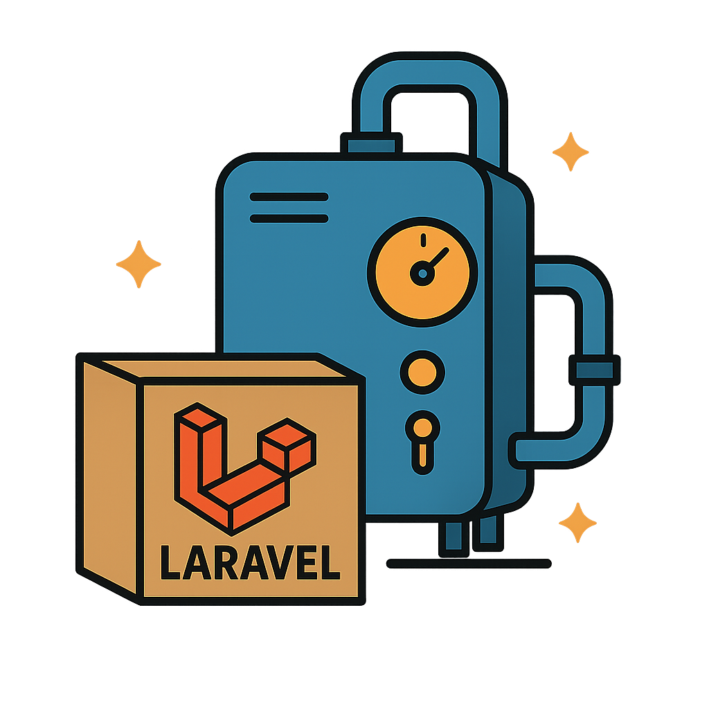

<br />
<br />
<h1 align="center">Laravel Boiler</h1>
<div align="center">
  <a href="https://github.com/YorCreative">
    
  </a>
</div>

<div align="center">
<a href="https://github.com/YorCreative/Laravel-Boiler/blob/main/LICENSE.md"></a>
<a href="https://github.com/YorCreative/Laravel-Boiler/stargazers"></a>

<a href="https://github.com/YorCreative/Laravel-Boiler/issues"></a>
<a href="https://github.com/YorCreative/Laravel-Boiler/network"></a>
<a href="https://github.com/YorCreative/Laravel-Boiler/actions/workflows/phpunit-tests.yml"></a>
</div>

# Installation

Follow these steps to set up and run the application containers locally using Docker.

## Prerequisites

Docker must be installed and running on your system.

## Steps

### 1. Clone or Fork the Repository
Obtain a copy of the repository by cloning or forking it to your local machine.

### 2. Build and Launch the Docker Containers

Ensure Docker is active, then use the following command to build and start all services in detached mode:
   ```bash
   docker compose up -d --build
   ```
Once complete, the application will be accessible at:
http://localhost:80


### 3. Initializing Setup
   
Run the setup script, outside the docker container in the repository's root.

```bash
bash setup.sh
```

   This will configure the application and prepare it for use.


### 4. Restoring a Fresh State

Running `setup.sh` creates backups of modified files and generates a `fresh-state.sh` script. You can execute `fresh-state.sh` to restore the repository to its initial state if you want to start over.
    
To restore, run the following command from the repository's root directory (outside the Docker container):
 ```bash
bash fresh-state.sh
```
